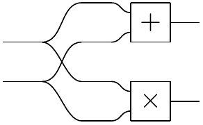

# HyperAST

A (currently experimental) frontend to
[open-hypergraphs](https://github.com/statusfailed/open-hypergraphs/)
which hijacks python syntax to define a hypergraph.

For example, you write:

    @hypergraph
    def adder(x0, x1):
        y0 = x0 + x1 # sum
        y1 = x0 * x1 # carry
        return [y0, y1]

To get an open hypergraph representing a string diagram like this:

In python syntax, variables serve as hypernodes while functions and python
operators are (labeled) hyperedges.

Unlike python code, hypergraphs are fully combinatorial: there is no implicit
assumption of 'causal' control flow.
For example, we can define a hypergraphs with *feedback*, such as a
[ring oscillator](https://en.wikipedia.org/wiki/Ring_oscillator):

    @hypergraph
    def ring_oscillator():
        x1 = ~x0 # we use x0 before declaring it - this is OK!
        x0 = ~x1
        return [x0]

This defines a string diagram like the one below:

